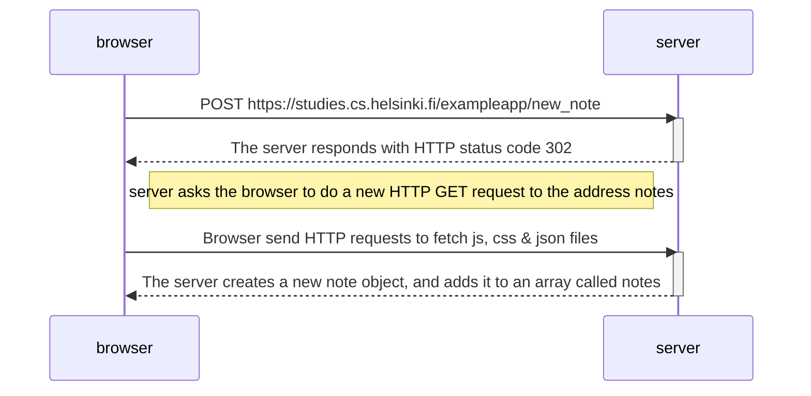

```mermaid
sequenceDiagram
    participant browser
    participant server

    browser->>server: POST https://studies.cs.helsinki.fi/exampleapp/new_note
    activate server
    server-->>browser: The server responds with HTTP status code 302
    
    deactivate server
    Note left of server: server asks the browser to do a new HTTP GET request to the address notes

    browser->>server: Browser send HTTP requests to fetch js, css & json files
    activate server
    server-->>browser: The server creates a new note object, and adds it to an array called notes
    deactivate server
```
