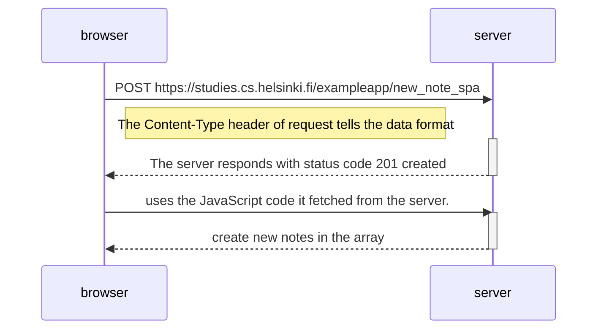

```mermaid
sequenceDiagram
    participant browser
    participant server

    browser->>server: POST https://studies.cs.helsinki.fi/exampleapp/new_note_spa
    Note right of browser: The Content-Type header of request tells the data format
    activate server
    server-->>browser: The server responds with status code 201 created
    deactivate server

    browser->>server: uses the JavaScript code it fetched from the server.
    activate server
    server-->>browser: create new notes in the array
    deactivate server
```
